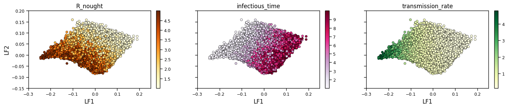

<<<<<<< HEAD
# PDTreeDL
Phylodynamics + Tree Encoding + Deep Learning
=======
# PDTreeDL
Phylodynamics + Tree Encoding + Deep Learning

------------
In phylodynamic framework, the evolutionary relationship of disease agents which can be obtained form genomic data and represented as trees provides insights on their spatio-temporal population dynamics. In this project, we aim to consolidate the usage of a tree encoding technique with statistical and deep learning frameworks to estimate epidemiological parameters from genomic and surveillance data. Future tasks also include superspreader detection and integration of multiple sources of information into phylodynamics frameworks.

The code provided in ``code/param_inf.py`` uses tree encodings simulated from birth death epidemiological model as inputs, and builds a convolutional variational autoencoder-based neural networks to infer three parameters of interest: *basic production number (R_nought)*, *infectious time*, and *transmission rate*. The tree encoding with branch length information shows promising predictive power for the parameters. 

``code/output_vis.ipynb`` contains a demo visualization of the 2D latent space representation of tree encodings learned from variational autoencoder, colored by the corresponding parameter values.

>>>>>>> 7eff9a781c3cb819a49b0e01c021e15f80b071b3
